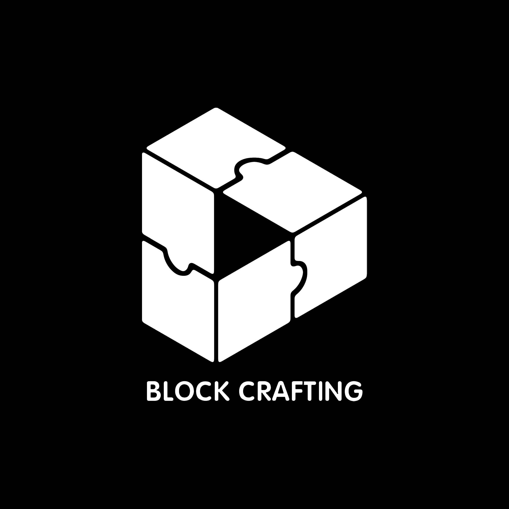

# 方块合成 Block Crafting

<!-- | [![][curseforge-badge]][curseforge-download] | [![][modrinth-badge]][modrinth-download] | [![][discord-badge]][discord-link] |
| -------------------------------------------- | ---------------------------------------- | ---------------------------------- | -->
| [![][discord-badge]][discord-link] |
| ---------------------------------- |

<h2 align="center">方块合成</h2>

方块合成使你能够通过搭建多方块结构来制作物品和其他东西。搭建特定结构，使用特定物品右键核心方块，结构会消失，并留下一些合成出的物品，召唤一些生物，或进行任何你想要的事情。  
你可以使用KubeJS来自定义这种配方。

使用教程：[Wiki](https://github.com/CPearl0/Block-Crafting/wiki)

### 相关链接：

> QQ群：`677453983`

---

<h2 align="center">Block Crafting</h2>

Block Crafting give you the ability to make items or other things out of multiblock structures. Build certain structure, then use certain item to right click on the core block, and the structurue will disappear, leaving some items that is crafted out, summoning some living entitys, or do anything you want.  
You can use KubeJS to custom such recipes.

Guide: [Wiki](https://github.com/CPearl0/Block-Crafting/wiki)  

### Links:

> QQ Group: `677453983`

---

<!-- [curseforge-badge]: https://img.shields.io/curseforge/dt/{}?style=for-the-badge&logo=curseforge&label=CurseForge%20Downloads&labelColor=0d0d0d&color=ff784d
[curseforge-download]: https://www.curseforge.com/minecraft/modpacks/{}
[modrinth-badge]: https://img.shields.io/modrinth/dt/{}?style=for-the-badge&logo=modrinth&labelColor=16181c&color=17b85a
[modrinth-download]: https://modrinth.com/mod/{} -->
[discord-badge]: https://img.shields.io/discord/1203359505841389670?style=for-the-badge&logo=discord&label=discord&labelColor=2b2d31&color=23a55a
[discord-link]: https://discord.gg/EbRDmZmGKz

